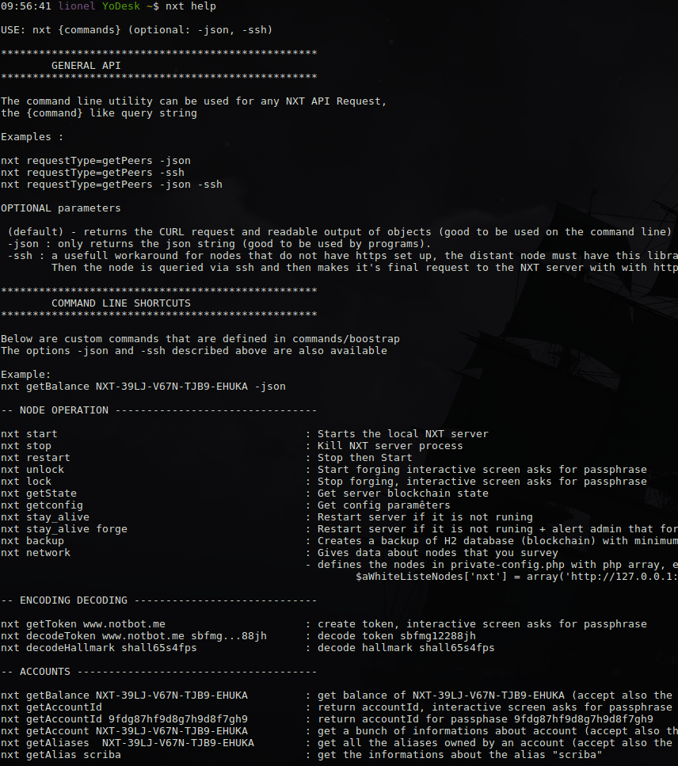

# NXT PHP Client

PHP library to easily call NXT API in your PHP projects 
+ a command line tool to facilitate node management and some blockchain queries.

Requirements: PHP5+ for the php library alone
Linux for the command line utiliy

## Instalation

If you have git installed:

```	
mkdir nxt-php-client; 
cd nxt-php-client; 
git clone https://github.com/websioux/nxt-php-client.git
```

else

```
wget https://github.com/websioux/nxt-php-client/archive/master.zip;
unzip nxt-php-client-master.zip; 
mv nxt-php-client-master nxt-php-client
```

## To use with PHP projects

Add `require('/PATH_TO/nxt-php-client/params.php')` and  `class CNxt extends CNxtApi {}` to the top of your PHP project

With having your own class you devellopp your own functions and do risk to loose them with an update.

Then to make a request use for instance:

```
$oApp = new CNxt;
$oApp->aInput = array(
				'requestType'=>'sendMoney',
				'recipient'=>'NXT-SL44-R65Z-HMNZ-7WVJM',
				'amountNQT'=>'500000000000',
				'secretPhrase'=>'PUT_YOUR_HOT_WALLET_SECRET',
				'message'=>'Here is your payment',
				'messageIsPrunable'=>true,
				'messageToEncrypt'=>true,
				'feeNQT'=>100000000				
);
$oResp = $oApp->getResponse();
```

If you need to make the same query on another node :

```
$oApp->protocol='https';
$oApp->host='nxt.notbot.me';
$oApp->protocol='443';

$oResp = $oApp->getResponse();
```
The class MyCNxt (in classes/mycnxt.php) is an example of a class extension which is used by 
the command line utility but that you do not really need in your projects.

## Set Up Command Line Utility:

* Create custom config

```
cp nxt-php-client/dummy-config.php nxt-php-client/private-config.php
```
and edit private-config.php with your server address.

* Add *nxt* as a bash alias of /PATH_TO/nxt-php-client/commands/bootstrap

```
echo "alias nxt='/PATH_TO/nxt-php-client/commands/bootstrap'" >>  ~/bash_aliases;
source ./bash_aliases
```

Try:

```
nxt help 
```
It gives




Here are some command examples :
```
nxt getState
```


```
nxt getTransaction 10294474557684324455
```


```
nxt getAliase apple
```


