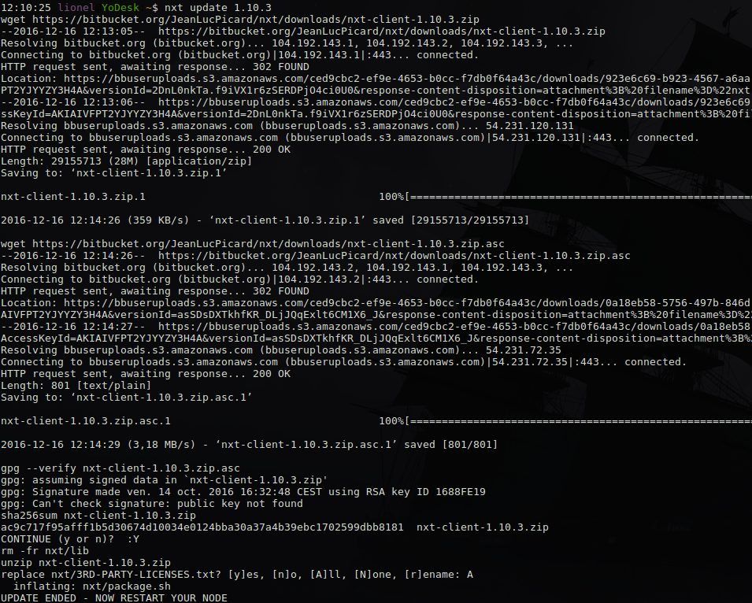
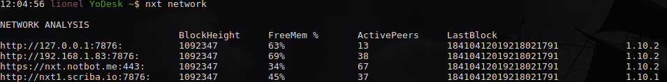
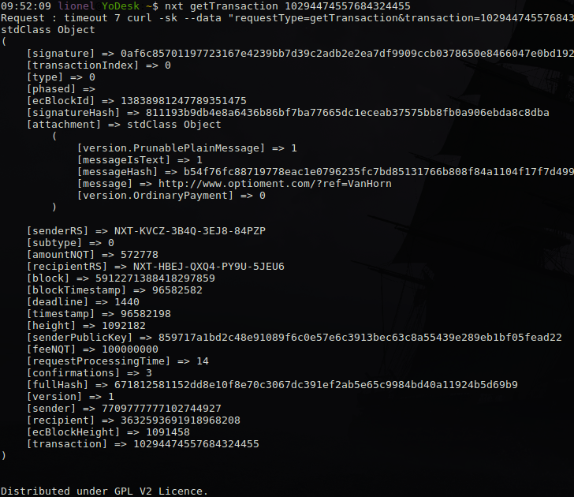

# NXT PHP Client

Here is a command line tool that facilitate NXT node management and to do some blockchain queries.
It comes with a very basic PHP library to call NXT API nodesj, that you may like to use in
you PHP projects.

Since it is a command line tool, it can also be used by any language via system calls.

Requirements: PHP5+ for the php library alone
Linux for the command line utiliy

## Instalation

If you have git installed:

```	
git clone https://github.com/websioux/nxt-php-client.git
```
(il will create the folder nxt-php-client)

else

```
wget https://github.com/websioux/nxt-php-client/archive/master.zip;
unzip nxt-php-client-master.zip; 
mv nxt-php-client-master nxt-php-client
```

## To use with PHP projects

Add `require('/PATH_TO/nxt-php-client/params.php')` and  `class CNxt extends CNxtApi {}` to the top of your PHP project

Having your own class to store your own functions remove the risk to loose anything during an update.

Here is an example of a sendMoney request :

```
$oApp = new CNxt;
$oApp->aInput = array(
				'requestType'=>'sendMoney',
				'recipient'=>'NXT-SL44-R65Z-HMNZ-7WVJM',
				'amountNQT'=>'500000000000',
				'secretPhrase'=>'PUT_YOUR_HOT_WALLET_SECRET',
				'message'=>'Here is your payment',
				'messageIsPrunable'=>true,
				'messageToEncrypt'=>true,
				'feeNQT'=>100000000				
);
$oResp = $oApp->getResponse();
```

If you need to make the same query to an another node :

```
$oApp->protocol='https';
$oApp->host='nxt.notbot.me';
$oApp->protocol='443';

$oResp = $oApp->getResponse();
```

The class *MyCNxt* (in classes/mycnxt.php) is an extension of the main class *CNxtApi* which was 
developped for the command line tool. You may not need it for your projects but you can use it 
as a starting example.

The command line tool consist of executing the script commands/bootstrap with a system alias.

## Set Up Command Line Tool:

* Create custom config

```
cp nxt-php-client/dummy-config.php nxt-php-client/private-config.php
```
and edit private-config.php with the server address of your choice

* Add *nxt* as a bash alias of /PATH_TO/nxt-php-client/commands/bootstrap

```
nxt-php-client/commands/add_alias; source ~/.bash_aliases;
```

To know all the commands

```
nxt help 
```

Here are some usefull command examples :

```
nxt update 1.10.3
```


```
nxt network
```


```
nxt getState
```


```
nxt getTransaction 10294474557684324455
```


```
nxt getAliase apple
```


